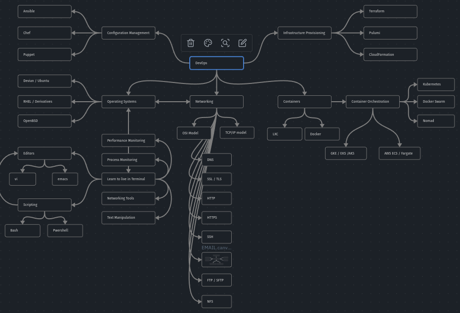

# DevOps Interview Preparation

## DevOps road map

*— Based on «[DevOps Roadmap](https://roadmap.sh/devops)»*
## Documentation

- [Interview](docs/Interview/Interview.md)
- [Links](Links.md)
- [DevOps](docs/DevOps/DevOps.md)
- [Networking](docs/Networking/Networking.md)
- [Operating Systems](docs/Operating%20Systems/Operating%20Systems.md)
- [Containers](docs/Containers/Containers.md)
	- [Container Orchestration](docs/Container%20Orchestration/Container%20Orchestration.md)
		- [Kubernetes](docs/Container%20Orchestration/Kubernetes/Kubernetes.md)
- [Configuration Management](docs/Configuration%20Management/Configuration%20Management.md)
- [Infrastructure Provisioning](docs/Infrastructure%20Provisioning/Infrastructure%20Provisioning.md)

## Usage

The best way to use this repository is to clone it and then open in the [Obsidian app](https://obsidian.md/). This will allow you to see the graph view of the notes and navigate between them.

## Contributing

If you have any questions or suggestions, please feel free to open an issue or a pull request.
