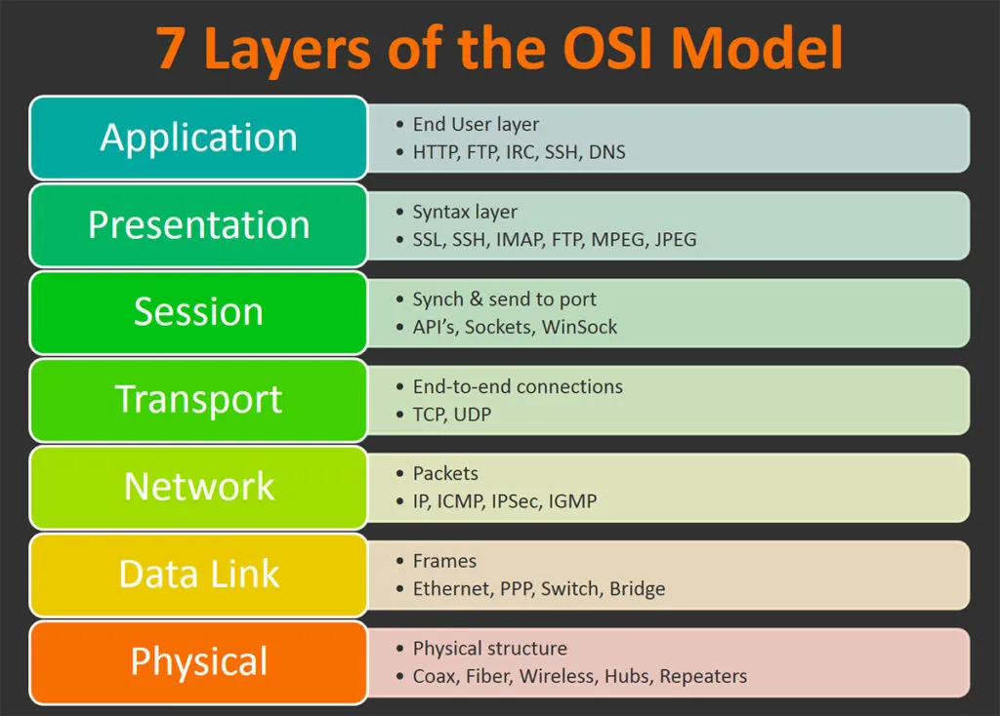

# OSI Model

## Layer architecture

The recommendation X.200 describes seven layers, labelled 1 to 7. Layer 1 is the lowest layer in this model.

## Reference

- [Understanding the OSI Model](https://int0x33.medium.com/day-51-understanding-the-osi-model-f22d5f3df756)