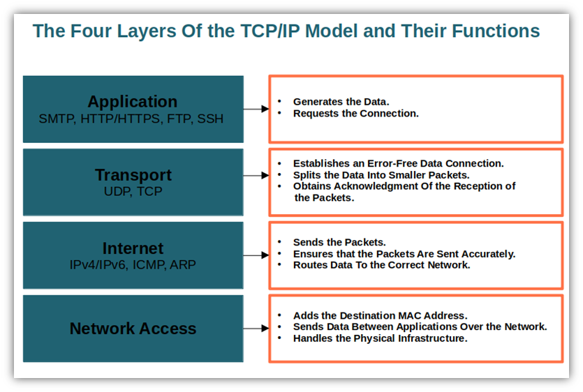
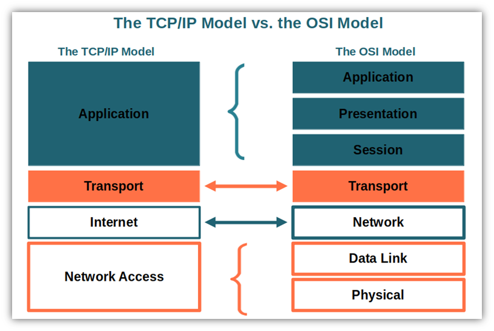

# TCP/IP Model

_An illustration of the four layers of the TCP/IP model._

## TCP Model vs OSI Model — Concise vs Verbose

Do you remember when talked about the importance of a common way to communicate? The open systems interconnection model was developed by the International Standards Organization (ISO) to address this need. Its goal? Ensure compatibility between electronic communication systems at a global level.

## Reference

- [What Is the TCP Model? An Exploration of TCP/IP Layers](https://cheapsslsecurity.com/blog/what-is-the-tcp-model-an-exploration-of-tcp-ip-layers/)
- [Transport Layer Protocols and Known Security Issues](https://int0x33.medium.com/day-55-transport-layer-protocols-and-known-security-issues-136109fa31d3)